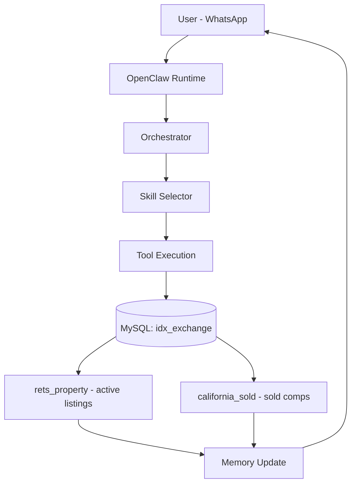

# OpenClaw Architecture Documentation
### IDX Exchange — AI Agentic Engineer Internship, Week 1

## Workflow Diagram



## Key Components

| Component | Role |
|---|---|
| **Channel (WhatsApp)** | Entry/exit point for the conversation. The channel adapter normalizes the inbound WhatsApp message into a common message format so the rest of the runtime is channel-agnostic. |
| **OpenClaw Runtime** | The core process that receives the normalized message, attaches or creates a session, and kicks off routing. Owns the lifecycle of a single request from arrival to response. |
| **Orchestrator** | Inspects the message and session context to decide which skill should handle the request (e.g. classifies "3 bed homes under $500k in Sacramento" as a property-search intent, vs. "what did similar homes sell for" as a market-analytics intent). |
| **Skill Selector** | Loads the matched skill module — e.g. property search, market analytics, or recommendation — and prepares it with parameters extracted from the message. |
| **Tool Execution** | The skill calls a typed async function that runs a parameterized MySQL query. This is the only layer that talks directly to the database, keeping the data layer isolated and swappable. |
| **MySQL: idx_exchange** | The schema holding both MLS tables. `rets_property` (~228,410 rows, 130+ fields) is the live search/discovery table for active listings. `california_sold` (~439,167 rows, 46 fields) holds sold/leased/closed transactions from 2021–2025 used as comps and for market analytics. |
| **Memory Update** | The query and result are written to session state (short-term) and optionally to vector storage (long-term, via embeddings), so follow-up messages (e.g. "show me cheaper ones") can resolve against this context. |
| **Response → User** | The formatted listings or comps are sent back through the WhatsApp channel adapter, closing the loop. |

## Data Layer Detail

Both tables live in the same MySQL schema and can be joined to correlate active listings with historical sold comps:

```sql
JOIN rets_property r
  ON CAST(r.L_ListingID AS UNSIGNED) = cs.ListingKey
```

Or, when a direct ID join isn't possible, by matching on city + postal code for market-level (rather than listing-level) analysis.

**`rets_property`** — active listings. Key fields: `L_ListingID`, `L_Address`, `L_City`, `L_Zip`, `L_Class`, `L_Type_`, `L_Keyword2` (beds), `LM_Dec_3` (baths), `L_SystemPrice`, `LM_Int2_3` (sqft), `LMD_MP_Latitude`/`Longitude`, `L_Status`, `L_Remarks` (full-text indexed), `L_Photos`, listing agent/office fields, `YearBuilt`, `AssociationFee`, `DaysOnMarket`, `PoolPrivateYN`, `ViewYN`, `ArchitecturalStyle`.

**`california_sold`** — sold/closed transactions. Key fields: `ListingKey`, `ClosePrice`, `CloseDate`, `OriginalListPrice`, `DaysOnMarket`, `PropertyType`/`PropertySubType`, `LivingArea`, `LotSizeAcres`, `BedroomsTotal`, `BathroomsTotalInteger`, `YearBuilt`, `City`, `PostalCode`, `Latitude`/`Longitude`, list/buyer agent and office fields, `GarageSpaces`, `AssociationFee`.

## Detailed Flow

1. **User → WhatsApp**: User sends a natural-language property query via WhatsApp.
2. **WhatsApp → OpenClaw Runtime**: The channel adapter normalizes the message and the runtime attaches it to a session.
3. **Runtime → Orchestrator**: The orchestrator classifies intent (search vs. comps/analytics vs. recommendation) and determines the appropriate skill.
4. **Orchestrator → Skill Selector**: The matched skill is loaded and parameters are extracted from the message (city, price range, beds, baths, etc.).
5. **Skill Selector → Tool Execution**: A typed async tool function is invoked with the extracted filters.
6. **Tool Execution → MySQL (`idx_exchange`)**: The tool runs a parameterized query against `rets_property` (active listings) and/or `california_sold` (sold comps), optionally joined on `ListingKey` / `L_ListingID`.
7. **MySQL → Memory Update**: Query and results are persisted to session (short-term) and vector (long-term) memory.
8. **Memory Update → Response → User**: A formatted response — listings, comps, or analytics — is generated and sent back to the user over WhatsApp.

## Example Tool Definition

Following the same pattern as the base `getCurrentTime()` / `handleMessage()` example, an MLS-backed tool against `rets_property` would look like:

```typescript
export async function queryActiveListings(filters: {
  city: string;
  maxPrice?: number;
  minBeds?: number;
}) {
  const [rows] = await pool.query(
    `SELECT L_ListingID, L_Address, L_City, L_SystemPrice, L_Keyword2, LM_Dec_3
     FROM rets_property
     WHERE L_City = ? AND L_Status = 'Active'
       AND (? IS NULL OR L_SystemPrice <= ?)
       AND (? IS NULL OR L_Keyword2 >= ?)
     LIMIT 20`,
    [filters.city, filters.maxPrice, filters.maxPrice, filters.minBeds, filters.minBeds]
  );
  return { listings: rows };
}

export async function handleMessage(message: string) {
  const filters = extractPropertyFilters(message);
  if (filters) {
    return await queryActiveListings(filters);
  }
  return { response: "I could not understand the request." };
}
```

